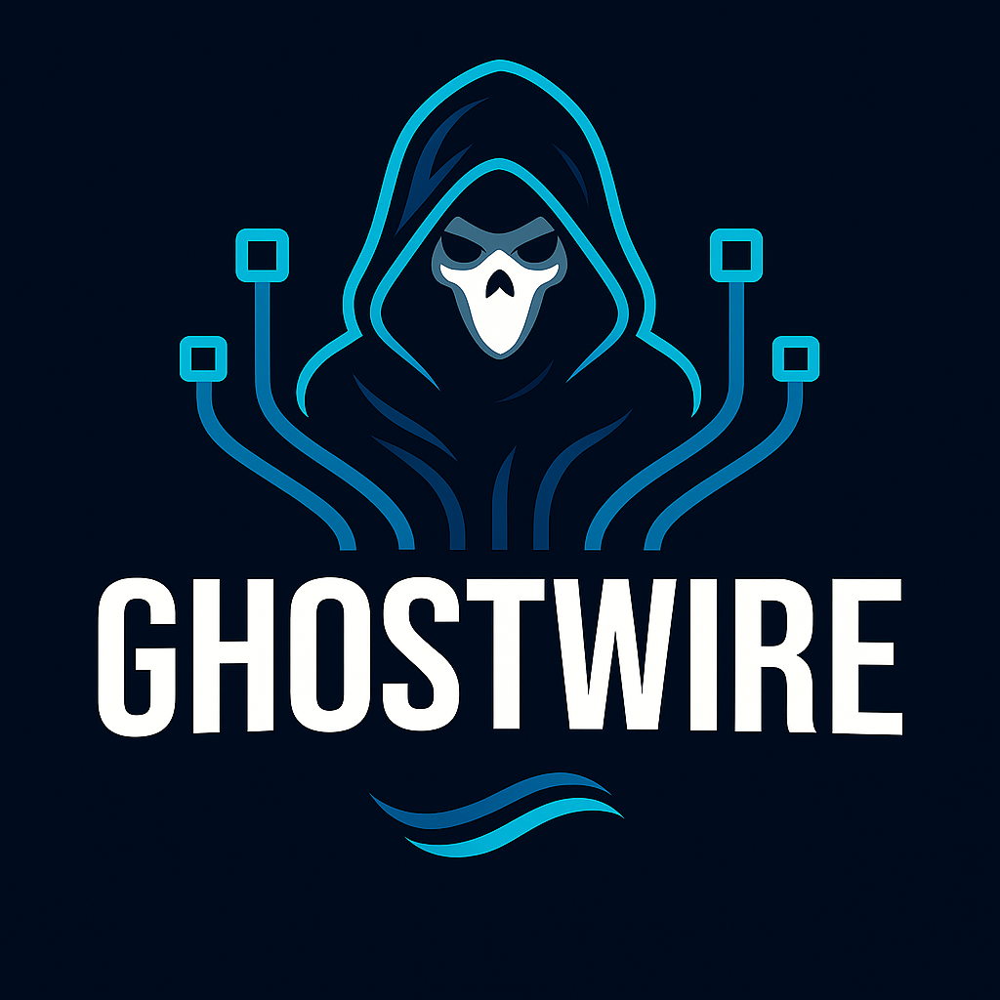

<div align="center">
  

# GhostWire

**A next-generation WireGuard mesh VPN — Rust control plane, Zig tools, zero-trust by default.**


</div>

---

## 🌐 Overview

**GhostWire** is a **self-hosted, zero-trust overlay network** inspired by Tailscale/Headscale — rebuilt from scratch in **Rust** with lightweight tooling in **Zig**.  
It uses **WireGuard** as the data plane, **QUIC/DERP-style relays** for NAT traversal, and a clean **Rust control plane** with OIDC for authentication.  

---

## ✨ Key Features

### 🔒 Security
- WireGuard-based encrypted mesh networking.
- Zero-trust: OIDC login (Azure Entra, Google, etc.).
- Automatic key rotation and ACL enforcement.
- Signed audit logs for all control plane actions.

### 🌍 Networking
- MagicDNS-like service discovery.
- Subnet routers + exit nodes.
- Route advertisement & priority support.
- Split-DNS with pluggable backends (Cloudflare, PowerDNS, etc.).

### 🚀 Performance
- QUIC/DERP-style relay server (`ghostderpd`) with multi-region map.
- Fast path UDP relaying with fallback to QUIC tunneling.
- NAT traversal via STUN/ICE techniques.

### 🛠️ Tooling
- **Client (`ghostwired`)** — Rust daemon with WireGuard + DNS integration.
- **Control Plane (`ghostwcd`)** — Rust API, namespaces, ACL compiler.
- **Relay (`ghostderpd`)** — QUIC/UDP relay for nodes behind NAT/firewalls.
- **CLI (`gwctl`)** — Admin UX for users, routes, ACLs.
- **Zig tools** — small static helpers for tun setup, packet inspection, testing.

### 📊 Observability
- Prometheus metrics from all components.
- Structured logs with Loki integration.
- CLI `gwctl status` for cluster health.

---

## 📁 Repository Layout
```
ghostwire/
├── Cargo.toml                    # Rust workspace
├── crates/
│   ├── ghostwire-common/         # shared types, crypto, protocols
│   ├── ghostwire-server/         # control plane API + coordination
│   ├── ghostwire-client/         # client daemon & networking
│   ├── ghostwire-cli/            # CLI (gwctl)
│   ├── ghostwire-derp/           # QUIC/DERP relay server
│   ├── ghostwire-dns/            # DNS drivers & MagicDNS
│   ├── ghostwire-proto/          # Protocol definitions (gRPC)
│   ├── ghostwire-web/            # Web admin interface (Leptos)
│   ├── ghostwire-desktop/        # Desktop GUI (eframe/egui)
│   ├── ghostwire-observability/  # Metrics & monitoring
│   └── ghostwire-tests/          # Integration tests & benchmarks
├── src/                          # Zig utilities & tools
│   ├── ghostctl/                 # Control utilities
│   └── ghostwire-**/             # Core networking components
├── docs/                         # Documentation
│   ├── DESIGN.md                 # System design & architecture
│   ├── WG_ANALYSIS.md           # WireGuard integration analysis
│   └── GUI_ARCH.md              # GUI architecture decisions
├── scripts/                      # Automation & deployment scripts
├── policies/                     # Security policies & configs
└── archive/                      # Reference implementations
    ├── headscale/                # Reference control plane
    └── tailscale/                # Protocol documentation
```

## 🛤️ Roadmap

- [ ] **Core**: key management, config, logging, tracing
- [ ] **Client**: WireGuard device, tun interface, DNS config
- [ ] **Control Plane**: namespaces, node registration, OIDC login
- [ ] **Relay**: QUIC DERP MVP
- [ ] **Routes**: advertise/accept routes, priorities
- [ ] **DNS**: MagicDNS-like, CF/PDNS backends
- [ ] **CLI**: `ghostwire up`, `route add`, `acl test`
- [ ] **Observability**: Prometheus metrics, Loki log tail

---

## ⚖️ License
[MIT](LICENSE)

---

## 🪄 Tagline Ideas
- *“Zero-trust networking, ghost-fast.”*  
- *“A WireGuard mesh with brains.”*  
- *“Private internet for your infra.”*  

