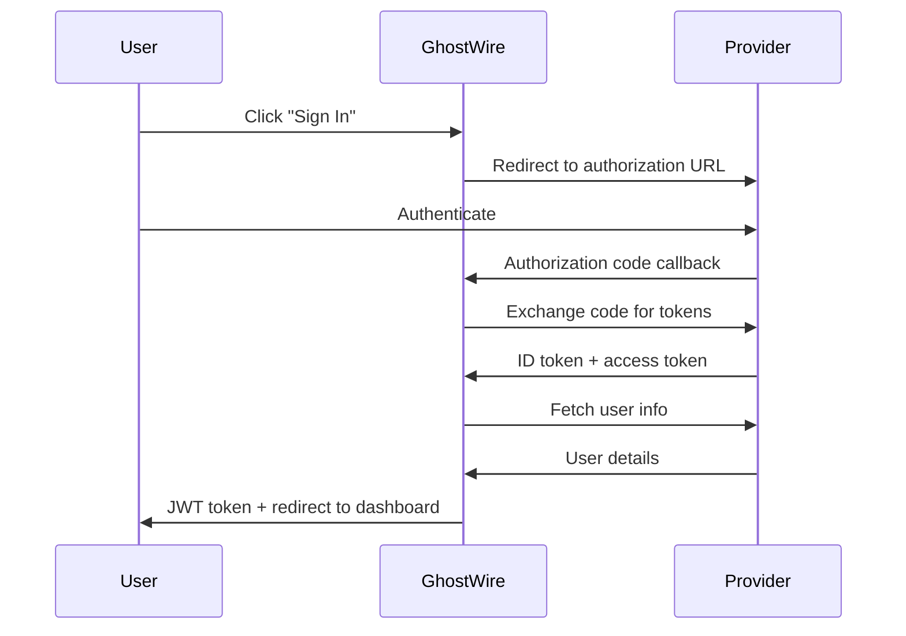

# Single Sign-On (SSO) Integration Guide

GhostWire supports comprehensive SSO integration with major identity providers including Microsoft Azure/Entra ID, Google Workspace, and GitHub. This guide covers setup, configuration, and troubleshooting for all supported providers.

## Overview

GhostWire's SSO implementation supports:

- **OpenID Connect (OIDC)** for standard SSO providers
- **OAuth 2.0** for GitHub and custom integrations
- **Device Flow** for CLI authentication
- **Multi-tenant support** for Azure
- **Group/Organization mapping** for access control

## Supported Providers

| Provider | Protocol | Device Flow | Group Sync | Multi-tenant |
|----------|----------|-------------|------------|-------------|
| **Microsoft Azure/Entra ID** | OIDC | ✅ | ✅ | ✅ |
| **Google Workspace** | OIDC | ✅ | ✅ | ❌ |
| **GitHub** | OAuth 2.0 | ✅ | ✅ | ❌ |
| **Generic OIDC** | OIDC | ✅ | ❌ | ❌ |

## Configuration

### Server Configuration

Add SSO configuration to your `server.yaml`:

```yaml
auth:
  oidc:
    enabled: true
    provider_url: "https://login.microsoftonline.com/{tenant}/v2.0"
    client_id: "your-client-id"
    client_secret: "${OIDC_CLIENT_SECRET}"
    redirect_uri: "https://ghostwire.yourdomain.com/auth/callback"
    scopes:
      - "openid"
      - "profile"
      - "email"
      - "User.Read"  # Azure-specific

  jwt:
    secret: "${JWT_SECRET}"
    expiration_hours: 24
    refresh_expiration_hours: 168  # 7 days
    issuer: "ghostwire-server"
    audience: "ghostwire-api"

  session:
    timeout_hours: 24
    cleanup_interval_hours: 1
```

### Environment Variables

```bash
# Required
OIDC_CLIENT_SECRET=your-client-secret
JWT_SECRET=your-secure-jwt-secret

# Optional
OIDC_TENANT_ID=your-azure-tenant-id  # For Azure
GOOGLE_WORKSPACE_DOMAIN=yourdomain.com  # For Google Workspace
GITHUB_ORG=your-github-org  # For GitHub organization
```

## Authentication Flows

### Web-based Authentication

1. User visits GhostWire web interface
2. Clicks "Sign in with [Provider]"
3. Redirected to identity provider
4. User authenticates with provider
5. Redirected back to GhostWire with authorization code
6. GhostWire exchanges code for tokens
7. User information retrieved and JWT issued



### CLI Device Flow Authentication

1. CLI runs `ghostwire auth login`
2. Device authorization request sent to provider
3. User code and verification URL displayed
4. User visits URL and enters code
5. CLI polls for token completion
6. JWT token stored securely

```bash
$ ghostwire auth login
Please visit: https://microsoft.com/devicelogin
Enter code: ABCD-EFGH
Waiting for authorization...
✓ Authentication successful
```

### API Token Authentication

For programmatic access, users can generate API tokens:

```bash
# Generate API token (requires authentication)
$ ghostwire auth token create --name "CI/CD Pipeline" --expires-in 30d
Token: gw_admin_v1_abc123...

# Use token for API access
$ curl -H "X-API-Key: gw_admin_v1_abc123..." \
       https://api.ghostwire.yourdomain.com/api/v1/nodes
```

## Provider-Specific Setup

### Quick Setup Links

- [Microsoft Azure/Entra ID Setup](./MICROSOFT_AZURE.md)
- [Google Workspace Setup](./GOOGLE.md)
- [GitHub Setup](./GITHUB.md)

### Provider Detection

GhostWire automatically detects the provider type based on the URL:

```rust
// Automatic detection
let provider_type = ProviderType::detect_from_url(&config.provider_url);

match provider_type {
    ProviderType::Azure => {
        // Uses Azure-specific scopes and parameters
        // Supports multi-tenant configurations
    }
    ProviderType::Google => {
        // Uses Google-specific scopes
        // Supports Workspace domain restrictions
    }
    ProviderType::GitHub => {
        // Uses OAuth 2.0 instead of OIDC
        // Supports organization membership checks
    }
    ProviderType::Generic => {
        // Standard OIDC implementation
    }
}
```

## User Management

### Automatic User Creation

When a user authenticates via SSO for the first time:

1. User record created automatically
2. Username derived from `preferred_username` or `email`
3. Profile information populated from provider
4. Default permissions assigned
5. Optional group/role mapping applied

### User Mapping Configuration

```yaml
auth:
  user_mapping:
    # Automatic user creation
    auto_create_users: true

    # Default permissions for new users
    default_permissions:
      - "node:read"
      - "node:write"
      - "user:read"

    # Admin user detection
    admin_users:
      - "admin@yourdomain.com"
      - "sysadmin@yourdomain.com"

    # Group-based permissions (provider-specific)
    group_mapping:
      "ghostwire-admins": ["admin"]
      "ghostwire-users": ["node:read", "node:write"]
      "ghostwire-readonly": ["node:read"]
```

### Manual User Management

Administrators can manage users through the web interface or API:

```bash
# List users
ghostwire users list

# Create user manually
ghostwire users create alice --email alice@example.com --admin

# Update user permissions
ghostwire users update alice --permissions "admin,node:write"

# Disable user
ghostwire users disable alice
```

## Security Considerations

### Token Security

- **JWT Secrets**: Use strong, randomly generated secrets (minimum 256 bits)
- **Token Expiration**: Short-lived access tokens (1-24 hours)
- **Refresh Tokens**: Longer-lived (7 days) with rotation
- **Secure Storage**: Tokens stored with encryption at rest

### OIDC Security

- **State Parameter**: CSRF protection for authorization flow
- **Nonce Validation**: Replay attack prevention
- **Token Validation**: Signature verification and claims validation
- **TLS Required**: All communication over HTTPS

### Access Control

- **Principle of Least Privilege**: Default minimal permissions
- **Role-Based Access**: Group/role mapping from provider
- **Session Management**: Automatic cleanup and revocation
- **Audit Logging**: All authentication events logged

## Troubleshooting

### Common Issues

#### 1. Authentication Failed

**Symptoms**: User gets "Authentication failed" error after SSO callback

**Causes**:
- Invalid client credentials
- Incorrect redirect URI
- Expired or invalid tokens
- Network connectivity issues

**Solutions**:
```bash
# Check configuration
ghostwire config validate

# Test OIDC discovery
curl https://login.microsoftonline.com/{tenant}/v2.0/.well-known/openid_configuration

# Check logs
journalctl -u ghostwire-server -f
```

#### 2. Token Validation Errors

**Symptoms**: "Invalid token" or "Token expired" errors

**Causes**:
- Clock skew between server and provider
- Incorrect JWT secret
- Token replay attacks
- Network latency

**Solutions**:
```bash
# Check server time synchronization
timedatectl status

# Verify JWT secret
echo $JWT_SECRET | wc -c  # Should be > 32

# Check token expiration
ghostwire auth token verify $TOKEN
```

#### 3. Device Flow Issues

**Symptoms**: CLI authentication hangs or fails

**Causes**:
- Provider doesn't support device flow
- Incorrect client permissions
- Network firewall blocking requests

**Solutions**:
```bash
# Test device flow endpoint
curl -X POST https://login.microsoftonline.com/{tenant}/oauth2/v2.0/devicecode \
     -H "Content-Type: application/x-www-form-urlencoded" \
     -d "client_id={client_id}&scope=openid"

# Use alternative authentication
ghostwire auth login --browser
```

### Debug Mode

Enable detailed authentication logging:

```yaml
# server.yaml
logging:
  level: debug
  modules:
    ghostwire_server::auth: trace
    openidconnect: debug
```

```bash
# Enable debug logging
RUST_LOG=ghostwire_server::auth=trace ghostwire-server serve

# Monitor authentication events
tail -f /var/log/ghostwire/auth.log | jq '.level == "ERROR" or .level == "WARN"'
```

### Health Checks

```bash
# Test OIDC connectivity
ghostwire auth test-connection

# Validate configuration
ghostwire auth validate-config

# Check provider status
curl -s https://login.microsoftonline.com/status
```

## Monitoring and Metrics

### Authentication Metrics

GhostWire collects the following authentication metrics:

- **Login Success Rate**: Percentage of successful authentications
- **Login Latency**: Time taken for authentication flows
- **Token Validation Rate**: Success rate of token validations
- **Provider Response Time**: Latency from identity providers
- **Failed Authentication Attempts**: Security monitoring

### Prometheus Metrics

```prometheus
# Authentication success rate
ghostwire_auth_success_total{provider="azure",method="oidc"}

# Authentication latency
ghostwire_auth_duration_seconds{provider="azure",method="oidc"}

# Active sessions
ghostwire_auth_active_sessions_total

# Token validation errors
ghostwire_auth_token_validation_errors_total{reason="expired"}
```

### Alerting Rules

```yaml
groups:
  - name: ghostwire_auth
    rules:
      - alert: HighAuthenticationFailureRate
        expr: |
          (
            rate(ghostwire_auth_failure_total[5m]) /
            rate(ghostwire_auth_total[5m])
          ) > 0.1
        for: 2m
        labels:
          severity: warning
        annotations:
          summary: High authentication failure rate
          description: "{{ $value }}% of authentications are failing"

      - alert: AuthenticationProviderDown
        expr: up{job="oidc-provider"} == 0
        for: 1m
        labels:
          severity: critical
        annotations:
          summary: Authentication provider is down
```

## Migration Guide

### From Password Authentication

1. **Enable SSO alongside passwords**:
   ```yaml
   auth:
     oidc:
       enabled: true
     local_auth:
       enabled: true  # Keep temporarily
   ```

2. **Migrate users gradually**:
   ```bash
   # Link existing users to SSO
   ghostwire users link alice alice@company.com --provider azure
   ```

3. **Disable password authentication**:
   ```yaml
   auth:
     local_auth:
       enabled: false
   ```

### Provider Migration

```bash
# Export user mappings
ghostwire auth export-users --format json > users.json

# Update configuration for new provider
vim server.yaml

# Restart server
systemctl restart ghostwire-server

# Import user mappings
ghostwire auth import-users users.json
```

## API Reference

### Authentication Endpoints

```http
# Initiate SSO login
GET /auth/login?provider=azure

# SSO callback
POST /auth/callback

# Device flow initiation
POST /auth/device/start
{
  "provider": "azure"
}

# Device flow polling
POST /auth/device/poll
{
  "device_code": "abc123",
  "provider": "azure"
}

# Token refresh
POST /auth/refresh
{
  "refresh_token": "refresh_token_here"
}

# Logout
POST /auth/logout
{
  "token": "access_token_here"
}
```

### User Management API

```http
# Get current user
GET /api/v1/user/me

# List users (admin)
GET /api/v1/users

# Update user (admin)
PATCH /api/v1/users/{id}
{
  "permissions": ["admin", "node:write"],
  "is_admin": true
}
```

This comprehensive SSO integration provides secure, scalable authentication for GhostWire mesh networks with enterprise-grade identity provider support.